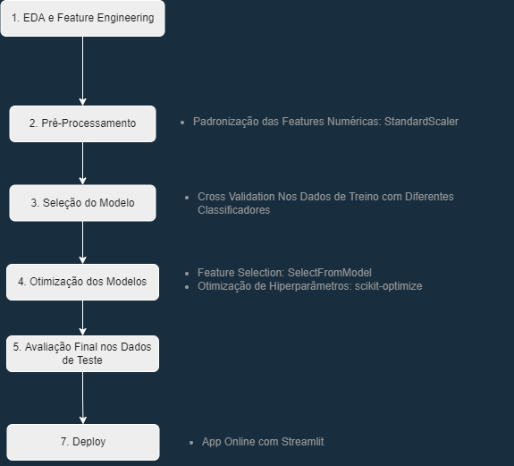
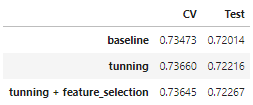
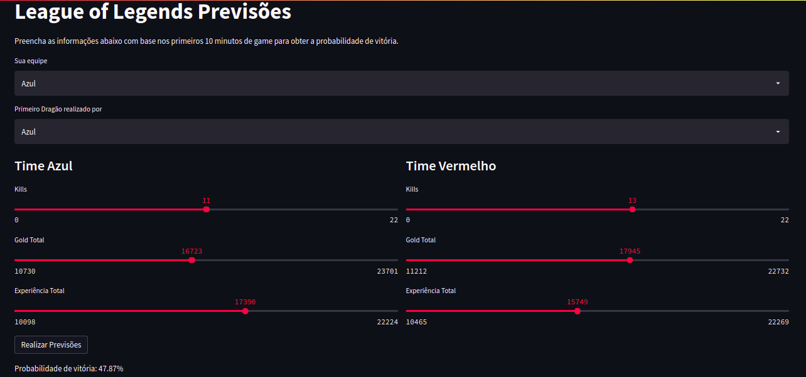

# Prevendo resultados de partidas de League of Legends.

## Links Úteis
- [Publicação no Medium](https://medium.com/@vini.guerra87/prevendo-o-resultado-de-partidas-de-league-of-legends-com-python-3c15c10a8784)
- [App online](https://share.streamlit.io/vinitg96/app_previsoes_league_of_legends/main/app.py)

## Contexto
League of Legends é um jogo eletrônico do gênero MOBA (Multiplayer Online Battle Arena) no qual duas equipes de cinco jogadores disputam em tempo real para destruir primeiro a base do adversário

Cada partida dura em média de 30 a 40 minutos, nesse período existem três fases principais: O early game (ou lane phasing) corresponde aos primeiros minutos de jogo onde os jogadores permanecem em suas rotas padrões; geralmente após a queda da primeira torre há uma rotação dos jogadores buscando realizar abates e conquistar objetivos, o chamado mid game; e por fim, o late game, quando a partida atinge os minutos finais e as lutas ou teamfights passam a ser decisivas.

Os dados utilizados contém informações referentes aos 10 primeiros minutos de aproximadamente 10.000 partidas rankeadas (do diamante até o mestre) coletadas diretamente da API da Riot Games e disponíveis publicamente no [Kaggle](https://www.kaggle.com/bobbyscience/league-of-legends-diamond-ranked-games-10-min).

## Objetivos

- Avaliar o impacto do early game no resultado final de partidas de League of Legends
- Treinar um modelo de machine learning para prever a probabilidade de uma equipe ser vencedora
- Realizar o deploy na forma de uma aplicação online.

## Metodologia

## Resultados

### Aspesctos de Business
- Gold, Experiência, o Dragão e Abates foram os fatores mais impactantes no início do jogo.
- Visão não se mostrou um atributo relevante no começo do jogo, embora espera-se que sua importância aumente com o passar dos minutos.
- O Dragão é um objetivo bem mais visado que o Arauto nessa etapa da partida.

### Aspectos Técnicos
- A Regressão Logística apresentou maior acurácia dentre os modelos avaliados após validação cruzada.
- O modelo final apresentou mais de 70% de acurácia em prever o resultado de partidas de League of Legends apenas com informações referentes aos 10 primeiros minutos de jogo, o que mostra a relevância dessa etapa no game no resultado final.
- As etapas de Feature Selection e Feature Engineering promoveram pequenas melhorias na performance do modelo, conforme pode ser visto abaixo:

## Deploy
A solução final consistiu em um [App Online](https://share.streamlit.io/vinitg96/app_previsoes_league_of_legends/main/app.py) desenvolvido com o streamlit.

